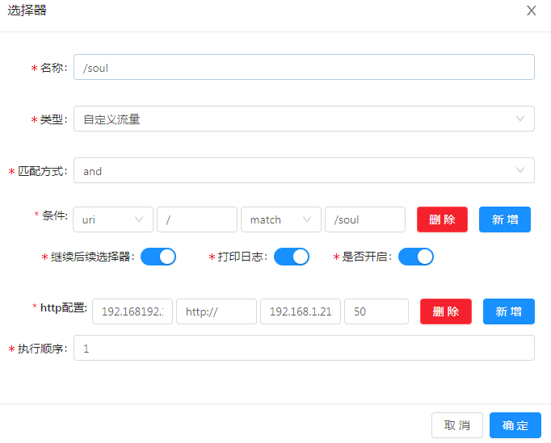
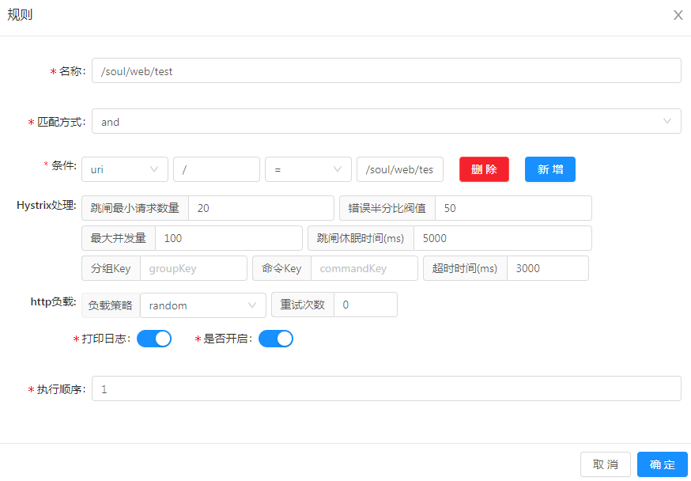
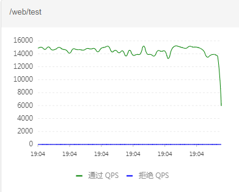
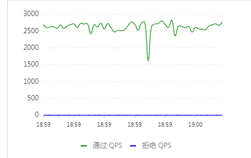
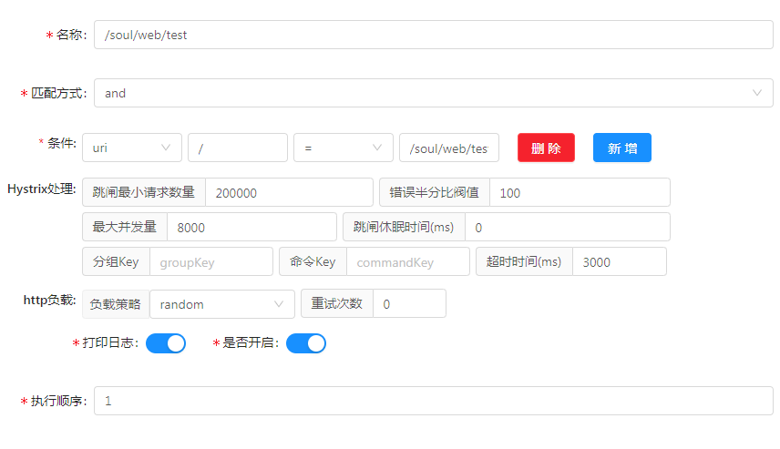

# Soul
> [文档](https://dromara.org/zh-cn/docs/soul/admin.html)

## 测试环境
### soul测试项目 （独立）
> 启动参数： -Xms2048m -Xmx2048m

系统：windows7 旗舰版  
处理器：Intel(R) Xeon(R) CPU E3-1230 v5 @ 3.40GHz 3.40GHz
系统类型： 64位操作系统
### 网关项目（独立）
系统：CentOS7  
Linux localhost.localdomain 4.15.15-1.el7.elrepo.x86_64 #1 SMP Sat Mar 31 16:41:40 EDT 2018 x86_64 x86_64 x86_64 GNU/Linux
CPU op-mode(s):        32-bit, 64-bit
Byte Order:            Little Endian
CPU(s):                2
### 网关管理后台 （独立）
同上
### Sentinel（独立）
同上

## 前置
#### soul-admin 
使用了mysql数据库,启动前请确保你正确安装了mysql.

```sh
java -jar soul-admin.jar \
--spring.datasource.url="jdbc:mysql://你的url:3306/soul?useUnicode=true&characterEncoding=utf-8&zeroDateTimeBehavior=CONVERT_TO_NULL&failOverReadOnly=false&autoReconnect=true&useSSL=false" \  
--spring.datasource.username='you username' \
--spring.datasource.password='you password'
 ```
#### soul-bootstrap（网关）
这个是整个soul服务的核心. 默认使用了 websocket 数据同步方式.
`java -jar soul-bootstrap.jar`

#### 网关配置
###### 插件
- soul-admin 插件管理启用 divide 

###### SoulAPI转发divide         





## 性能测试
在测试之前所有链路经过较长时间的大高发压测，保证参数、JIT已经稳定。

并添加了Tengine监控QPS。


### webbench-1.5
#### 原路径请求

800并发60秒压测QPS：



#### 网关代理路径请求
可能以`Soul`存在理解或以配置问题，无法将大量的请求打到`Web`。
贴出800并发60秒压测QPS：



单机QPS较低，大部份请求数据被融断（已修改调整请求资源的融断规则，允许并发量8000）


当然，更大的可能是对`soul`的理解不够，无法提供较的测试数据。

如果有时间，再继续深入了解与探索。