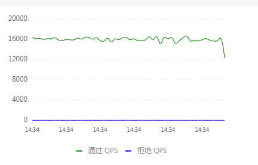
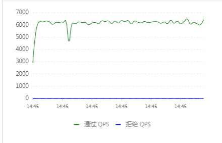
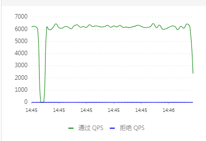
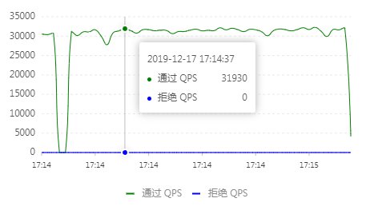
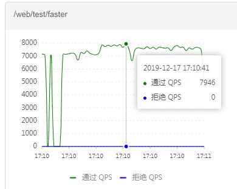
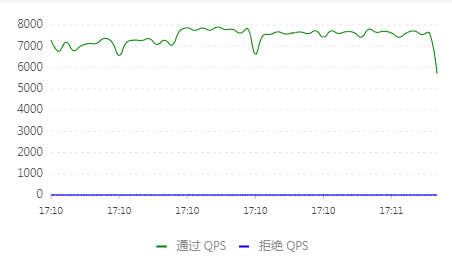

# Spring Cloud Gateway
> [文档](https://spring.io/projects/spring-cloud-gateway)

## 测试路径
通过`SpringCloudGateway`访问测试用`webDemo`

## 测试环境
### 测试项目 （独立）
> webDemo 启动参数： -Xms2048m -Xmx2048m

系统：windows7 旗舰版  
处理器：Intel(R) Xeon(R) CPU E3-1230 v5 @ 3.40GHz 3.40GHz
系统类型： 64位操作系统

### 网关项目（独立）
> spring-cloud-gateway 打包放置运行
> mvn package -Dmaven.test.skip=true -pl spring-cloud-gateway -am

系统：CentOS7  
Linux localhost.localdomain 4.15.15-1.el7.elrepo.x86_64 #1 SMP Sat Mar 31 16:41:40 EDT 2018 x86_64 x86_64 x86_64 GNU/Linux
CPU op-mode(s):        32-bit, 64-bit
Byte Order:            Little Endian
CPU(s):                2
### Sentinel（独立）
同上


## 性能测试
在测试之前所有链路经过较长时间的大高发压测，保证参数、JIT已经稳定。

并添加了Tengine监控QPS。

### webbench-1.5
#### 原路径请求

WebDemo800并发60秒压测QPS：
> 测试参数：webbench -t 60 -c 800


#### 网关代理路径请求
###### 未调优

网关800并发60秒压测QPS：


WebDemoQPS：


在未经过调优的情况下，QPS由16000左右下降到6200左右，降低了61%。
    

### wrk 4.1.0
> 测试参数：  wrk -t 4 -c 800 -d 60s
#### 原路径请求

WebDemo800并发60秒压测QPS：

```
  4 threads and 800 connections
  Thread Stats   Avg      Stdev     Max   +/- Stdev
    延迟       31.90ms   73.79ms   1.57s    98.94%
    每秒请求数  7.82k   535.83    11.95k    79.17%
  延迟分布
     50%   25.27ms
     75%   27.24ms
     90%   29.66ms
     99%  144.76ms
  1867560 requests in 1.00m, 212.27MB read
Requests/sec:  31106.53（平均每秒QPS）
Transfer/sec:  3.54MB（平均每秒流量）
```
#### 网关代理路径请求

网关800并发60秒压测QPS：

```
  4 threads and 800 connections
  Thread Stats   Avg      Stdev     Max   +/- Stdev
    延迟        108.47ms   42.87ms 345.43ms   70.16%
    每秒请求数   1.85k   241.25     2.73k    70.75%
  延迟分布
     50%  108.65ms
     75%  134.78ms
     90%  161.94ms
     99%  216.29ms
  443007 requests in 1.00m, 51.13MB read
Requests/sec:   7375.29（平均每秒QPS）
Transfer/sec:   0.85MB（平均每秒流量）
```
WebDemoQPS：


结果：从结果来看，QPS由31106降至7375，降低了76%，平均时间延迟增加了3.4倍。