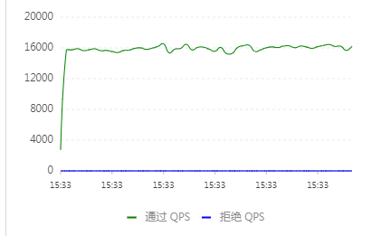
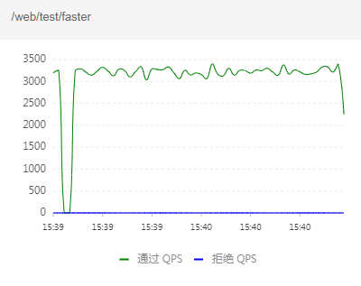
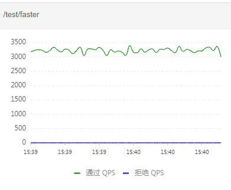
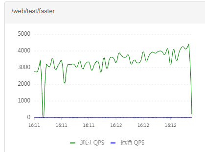
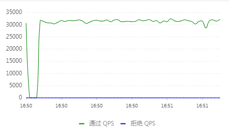
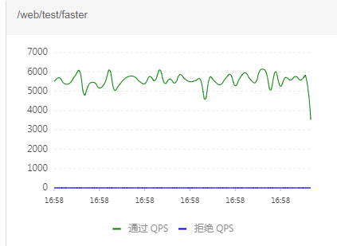
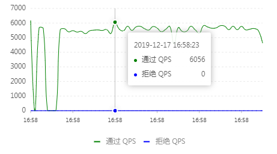

# Spring Cloud Zuul

## 测试路径
通过`SpringCloudZuul`访问测试用`webDemo`

## 测试环境
### 测试项目 （独立）
> webDemo 启动参数： -Xms2048m -Xmx2048m

系统：windows7 旗舰版  
处理器：Intel(R) Xeon(R) CPU E3-1230 v5 @ 3.40GHz 3.40GHz
系统类型： 64位操作系统

### 网关项目（独立）
> spring-cloud-zuul 打包放置运行
> mvn package -Dmaven.test.skip=true -pl spring-cloud-zuul -am

系统：CentOS7  
Linux localhost.localdomain 4.15.15-1.el7.elrepo.x86_64 #1 SMP Sat Mar 31 16:41:40 EDT 2018 x86_64 x86_64 x86_64 GNU/Linux
CPU op-mode(s):        32-bit, 64-bit
Byte Order:            Little Endian
CPU(s):                2
### Sentinel（独立）
同上


## 性能测试
在测试之前所有链路经过较长时间的大高发压测，保证参数、JIT已经稳定。

并添加了Tengine监控QPS。

### webbench-1.5
> 测试参数：webbench -t 60 -c 800
#### 原路径请求

WebDemo800并发60秒压测QPS：


> 多次压测整体没啥变化

#### 网关代理路径请求
###### 未调优

网关800并发60秒压测QPS：


WebDemoQPS：


在未经过调优的情况下，QPS由16000左右下降到3200左右，降低了80%。

###### 调优1
```
zuul:
  semaphore:
    # Zuul use semaphore isolation by default.
    max-semaphores: 5000
```
结果： 基本一致，没有看到提升
###### 调优2
```
zuul:
  semaphore:
    # Zuul use semaphore isolation by default.
    max-semaphores: 5000
  host:
    max-total-connections: 1000
    max-per-route-connections: 800
```
网关800并发60秒压测QPS：

结果： 有一定的提升，但是总体来说，区线变化过大，对服务来说，更加的不友好。

### wrk 4.1.0
> 测试参数：  wrk -t 4 -c 800 -d 60s
#### 原路径请求

WebDemo800并发60秒压测QPS：

```
  4 threads and 800 connections
  Thread Stats   Avg      Stdev     Max   +/- Stdev
    延迟        31.56ms   67.35ms   1.49s    98.82%
    每秒请求数   7.87k    519.44    10.62k    81.38%
  延迟分布
     50%   25.11ms
     75%   26.91ms
     90%   28.71ms
     99%  220.80ms
  1879506 requests in 1.00m, 213.63MB read
Requests/sec:  31307.53（平均每秒QPS）
Transfer/sec:  3.56MB（平均每秒流量）
```
#### 网关代理路径请求
###### 调优2
```
zuul:
  semaphore:
    # Zuul use semaphore isolation by default.
    max-semaphores: 5000
  host:
    max-total-connections: 1000
    max-per-route-connections: 800
```
网关800并发60秒压测QPS：

```
  4 threads and 800 connections
  Thread Stats   Avg      Stdev     Max   +/- Stdev
    延迟        145.17ms 79.66ms   1.98s    83.96%
    每秒请求数   1.40k    300.66    2.18k    69.45%
  延迟分布
     50%  136.78ms
     75%  172.16ms
     90%  218.11ms
     99%  337.39ms
  335116 requests in 1.00m, 51.76MB read
  Socket errors: connect 0, read 0, write 0, timeout 170
Requests/sec:   5580.81（平均每秒QPS）
Transfer/sec:   0.86MB（平均每秒流量）
```
WebDemoQPS：


结果： 如果通过网关进行请求，由平均31307下降为5580，降低了82%，平均时间延迟增加了4.6倍。